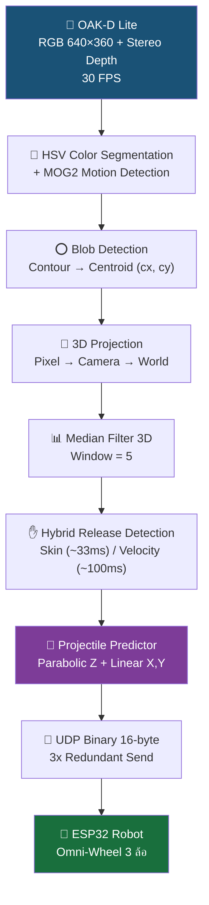
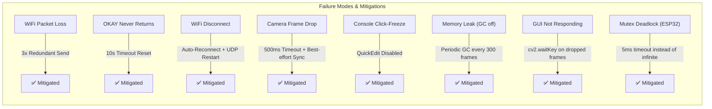

# MCE14 Vission-16 — Technical Report
## ระบบ 3D Vision สำหรับหุ่นยนต์รับบอล

> **Project**: MCE14 Vission-16
> **Hardware**: OAK-D Lite (Stereo Depth Camera) + ESP32 (Omni-Wheel 3 ล้อ)
> **Software**: Python 3.10+ / DepthAI v3 / OpenCV 4.x / Arduino (FreeRTOS)
> **Date**: 2 June 2026

---

## 1. System Overview

ระบบ MCE14 Vission-16 เป็นระบบ real-time 3D vision สำหรับหุ่นยนต์รับบอล ออกแบบให้ทำงานได้ภายใน **end-to-end latency < 35ms** (GUI mode) หรือ **< 12ms** (headless mode) โดยมี pipeline ดังนี้:



---

## 2. Hardware Specifications

### 2.1 OAK-D Lite Camera
| Parameter | Value |
|-----------|-------|
| RGB Sensor | IMX214 (4K) — ใช้ที่ 640×360 |
| Stereo Baseline | 75mm |
| Depth Range | 200mm – 6000mm |
| Frame Rate | 30 FPS (RGB + Depth synchronized) |
| Interface | USB 3.0 |
| VPU | Intel Movidius Myriad X |
| On-device Processing | Spatial Filter, Temporal Filter, Subpixel |

### 2.2 ESP32 Robot
| Parameter | Value |
|-----------|-------|
| MCU | ESP32 Dual-Core 240MHz |
| Motors | 3× DC Motor + Encoder (17 PPR × 19:1 gear) |
| IMU | MPU6050 (Gyroscope FS 500°/s) |
| Wheels | Omni-Wheel 3 ล้อ (R = 41mm, L = 271.5mm) |
| Communication | WiFi 2.4GHz → UDP Port 12345 |
| Control Rate | 100 Hz (10ms loop) |

### 2.3 Network
| Parameter | Value |
|-----------|-------|
| Router | TP-Link AX3000 (2.4 GHz, Channel Fixed) |
| SSID | MCE14 |
| PC IP | 192.168.1.10 |
| ESP32 IP | 192.168.1.20 |
| Protocol | UDP Binary 16-byte fixed-size |

---

## 3. Vision Pipeline — Detail

### 3.1 Stage A: Camera Initialization & Frame Capture

กล้อง OAK-D Lite ถูกตั้งค่าผ่าน DepthAI v3 Pipeline API:

```python
# RGB Camera
cam_rgb.requestOutput((640, 360), type=BGR888i, fps=30)

# Stereo Depth
stereo.build(presetMode=FAST_ACCURACY)
stereo.setSubpixel(True)           # Sub-pixel disparity
stereo.setLeftRightCheck(True)     # L-R consistency check
stereo.setDepthAlign(CAM_A)        # Align depth → RGB
stereo.setOutputSize(640, 360)     # Match RGB resolution
# On-VPU Filters:
stereo.vpu_spatial_filter = True   # Spatial noise reduction
stereo.vpu_temporal_filter = True  # Temporal smoothing
```

**Frame Synchronization** — ฟังก์ชัน `get_synced_frames()`:

1. **Flush queues** — ดึง frame ล่าสุดจาก queue (ทิ้ง stale frames)
2. **Timeout polling** — ถ้า queue ว่าง → poll ด้วย `tryGet()` ทุก 2ms, timeout 500ms
3. **Sequence alignment** — จับคู่ RGB + Depth ด้วย `getSequenceNum()` (max 10 attempts)
4. **Best-effort return** — ถ้า sync ไม่ได้ → return best available pair

```
Queue maxSize = 4, blocking = False
→ Drop strategy: เก็บเฉพาะ frame ล่าสุด
→ ป้องกัน latency buildup จาก old frames
```

**Timestamp** — ใช้ **device hardware timestamp** (`getTimestampDevice()`) แทน host `time.perf_counter()` เพื่อลด jitter จาก OS scheduling

---

### 3.2 Stage B: HSV Color Segmentation

ตรวจจับลูกบอลสีแดงด้วย dual-range HSV thresholding:

| Parameter | Range 1 | Range 2 |
|-----------|---------|---------|
| H | 0 – 10 | 170 – 180 |
| S | 100 – 255 | 100 – 255 |
| V | 80 – 255 | 80 – 255 |

```python
# GPU-accelerated (OpenCL UMat) pipeline:
frame_hsv = gpu_cvt_color(frame_bgr, BGR2HSV)
mask1 = gpu_in_range(frame_hsv, lower_red_1, upper_red_1)
mask2 = gpu_in_range(frame_hsv, lower_red_2, upper_red_2)
hsv_mask = bitwise_or(mask1, mask2)

# Morphology cleanup (GPU):
hsv_mask = erode(hsv_mask, kernel_5x5, iterations=1)
hsv_mask = dilate(hsv_mask, kernel_5x5, iterations=2)
```

### 3.3 Stage C: MOG2 Motion Detection

Background Subtractor MOG2 สร้าง motion mask เพื่อกรอง static red objects:

```python
# Sub-sampled every 2 frames (optimization C-05)
raw_motion = bg_subtractor.apply(frame, learningRate=0.005)
motion_mask = dilate(raw_motion, kernel, iterations=2)
has_motion = countNonZero(motion_mask) > 100
```

เมื่อ `use_motion = True` (หลัง SET ZERO):
```
final_mask = HSV_mask AND dilated_motion_mask
```
→ กำจัดวัตถุสีแดงที่ไม่เคลื่อนที่ (เทปสีแดง, ป้าย, เสื้อผ้า)

---

### 3.4 Stage D: Blob Detection & Centroid

```python
contours = cv2.findContours(mask, RETR_EXTERNAL, CHAIN_APPROX_SIMPLE)
```

**Filtering criteria:**
| Criterion | Min | Max | Purpose |
|-----------|-----|-----|---------|
| Area | 50 px² | 50,000 px² | กรอง noise / วัตถุใหญ่เกิน |
| Circularity | 0.4 | — | กรองวัตถุไม่กลม |

**Circularity formula:**
$$C = \frac{4\pi \cdot A}{P^2}$$

โดย $A$ = area, $P$ = perimeter — วงกลมสมบูรณ์ = 1.0

**Output:** `ball_info = { cx, cy, area }` — จุดศูนย์กลาง pixel และพื้นที่

---

### 3.5 Stage E: 3D Projection

แปลง pixel coordinate (cx, cy) + depth → 3D position ในระบบกล้อง:

#### Camera Intrinsics (Factory Calibration):
$$\mathbf{K} = \begin{bmatrix} f_x & 0 & c_x \\ 0 & f_y & c_y \\ 0 & 0 & 1 \end{bmatrix}$$

#### Pixel → Camera Frame:
$$X_{cam} = \frac{(u - c_x) \cdot Z}{f_x}$$
$$Y_{cam} = \frac{(v - c_y) \cdot Z}{f_y}$$
$$Z_{cam} = \text{depth\_mm} / 1000$$

#### Depth Lookup Strategy:
```python
# 5×5 ROI around centroid — median of valid pixels
depth_roi = depth_frame[cy-2:cy+3, cx-2:cx+3]
valid = depth_roi[depth_roi > 0]
z_mm = np.median(valid) if len(valid) > 0 else depth_frame[cy, cx]
```
→ Median ROI ลด noise จาก depth hole และ stereo mismatch

#### Camera → World Frame (Extrinsics):
$$\mathbf{p}_{world} = \mathbf{R} \cdot \mathbf{p}_{cam} + \mathbf{T}$$

**Rotation Matrix R** — หมุน 90° เพื่อเปลี่ยนระบบพิกัด:
$$\mathbf{R} = \begin{bmatrix} 1 & 0 & 0 \\ 0 & 0 & 1 \\ 0 & -1 & 0 \end{bmatrix}$$

| Camera Axis | → | World Axis | ความหมาย |
|------------|---|-----------|---------|
| X_cam | → | X_world | ซ้าย/ขวา |
| Y_cam | → | Z_world | ความสูง (ลง→ขึ้น, กลับเครื่องหมาย) |
| Z_cam | → | Y_world | ความลึก (ไปข้างหน้า) |

**Translation Vector T** — ความสูงกล้องจากพื้น:
$$\mathbf{T} = \begin{bmatrix} 0 \\ 0 \\ h_{camera} \end{bmatrix} \approx \begin{bmatrix} 0 \\ 0 \\ 0.83 \end{bmatrix} \text{ m}$$

$h_{camera}$ ถูก auto-calibrate ตอน SET ZERO จาก Y_cam ของลูกบอลที่วางบนพื้น

#### Zero Offset (SET ZERO Calibration):
$$\mathbf{p}_{relative} = \mathbf{p}_{world} - \mathbf{p}_{zero}$$

ทำให้ตำแหน่งลูกบอลเป็นสัมพัทธ์กับจุดศูนย์กลางหุ่นยนต์

---

### 3.6 Stage F: Median Filter 3D

Sliding window median filter กรอง noise ทีละแกน:

```python
buffer = deque(maxlen=5)  # window_size = 5
buffer.append(point_3d)
filtered = np.median(np.array(buffer), axis=0)
```

| Parameter | Value | Effect |
|-----------|-------|--------|
| Window size | 5 | กรอง outlier ได้ดี แต่ delay ~83ms |
| Min samples | 2 | เริ่ม filter เมื่อมี ≥ 2 จุด |

> **Trade-off**: window=5 ให้ noise rejection ดี แต่ group delay = 2.5 frames ≈ 83ms ที่ 30fps

---

### 3.7 Stage G: Hybrid Release Detection

ตรวจจับจังหวะที่มือปล่อยลูกบอล ใช้ 2 methods แบบ OR logic:

#### Method 1 — Skin-based (FAST ~33ms):

**เงื่อนไข:**
1. `skin_ratio < 0.08` — ไม่มีผิวหนังรอบลูกบอล
2. `velocity > 0.5 m/s` — ลูกบอลกำลังเคลื่อนที่

**Skin Detection Algorithm:**
```
1. กำหนด annular region (donut) รอบลูกบอล:
   - inner_r = ball_radius (ข้ามพิกเซลสีแดงของลูก)
   - outer_r = 2.5 × ball_radius (บริเวณนิ้วมือ)
2. Crop ROI สี่เหลี่ยม → cvtColor BGR→HSV
3. สร้าง annular mask ด้วย distance calculation
4. Threshold skin color: H[5-25], S[40-255], V[80-255]
5. skin_ratio = skin_pixels_in_annulus / total_annulus_pixels
```

**Optimization (C-04):** Skip skin check เมื่อ velocity < 0.5 m/s — ประหยัด ~1-2ms/frame ก่อนโยน

#### Method 2 — Velocity + Displacement (FALLBACK ~100ms):

**เงื่อนไข:**
1. `velocity > 1.2 m/s` — ลูกบอลบินเร็วพอ
2. `displacement > 10 cm` — ย้ายตำแหน่งมากพอ

```python
velocity = |pos_3d - prev_pos| / dt
displacement = |pos_3d - start_pos|
```

**ทำไมต้อง Hybrid?**
- Method 1 ตรวจจับได้เร็ว (~1 frame = 33ms) แต่อาจ false positive ถ้าแสงไม่ดี
- Method 2 ช้ากว่า (~3-5 frames = 100ms) แต่เสถียรกว่า
- OR logic: ใครเจอก่อน trigger ก่อน — ได้ทั้งความเร็วและ fallback

---

### 3.8 Stage H: Projectile Predictor

ทำนายจุดตกของลูกบอลที่ความสูง **z_catch = 25 cm** (ความสูงของมือหุ่นยนต์)

#### Mathematical Model:

**Vertical motion (Parabolic):**
$$Z(t) = at^2 + bt + c$$

- Fit ด้วย `np.polyfit(ts, zs, degree=2)`
- `a < 0` → แรงโน้มถ่วงดึงลง
- ในทางทฤษฎี: $a \approx -4.9$ m/s² (half gravity)

**Horizontal motion (Linear):**
$$X(t) = m_x \cdot t + b_x$$
$$Y(t) = m_y \cdot t + b_y$$

- Fit ด้วย `np.polyfit(ts, xs, degree=1)` / `np.polyfit(ts, ys, degree=1)`

#### Prediction Algorithm:

```
1. ตรวจสอบ: buffer ≥ min_points (3) AND time_span ≥ 66ms
2. Normalize time: ts_norm = ts - ts[0]
3. Fit Z(t) quadratic → get a, b, c
4. Verify: a < 0 (gravity check)
5. Solve: a·t² + b·t + (c - z_catch) = 0
6. t_land = max(t1, t2) — เลือก root ที่เป็นขาลง
7. Verify: t_land > t_latest (ต้องเป็นอนาคต)
8. Predict: X(t_land), Y(t_land)
9. Apply drag correction: × 0.92
10. Clamp to workspace: radius ≤ 0.5m
```

#### Air Drag Correction:

$$X_{land} = X_0 + (X_{raw} - X_0) \times 0.92$$

Factor 0.92 ชดเชยแรงต้านอากาศที่ทำให้ลูกบอลไม่ไกลเท่าที่ทำนาย

#### Workspace Clamping:

$$d = \sqrt{X_{land}^2 + Y_{land}^2}$$

ถ้า $d > 0.5$ m:
$$X_{clamped} = \frac{X_{land}}{d} \times 0.5, \quad Y_{clamped} = \frac{Y_{land}}{d} \times 0.5$$

---

### 3.9 Stage I: Robot Position Tracking

ติดตามตำแหน่งหุ่นยนต์ด้วย Gold-colored marker (HSV thresholding):

| Parameter | Value |
|-----------|-------|
| H range | 15 – 35 |
| S range | 80 – 255 |
| V range | 80 – 255 |
| Min area | 100 px² |
| Max area | 50,000 px² |
| Sub-sample | ทุก 15 เฟรม |

**3D Position**: ใช้เทคนิคเดียวกับ ball detection (depth lookup + 3D projection) แต่ sub-sample ทุก 15 เฟรม เพราะหุ่นเคลื่อนที่ช้ากว่าลูกบอล

---

## 4. Communication Protocol

### 4.1 UDP Binary Packet (PC → ESP32)

```
Offset  Size    Type      Field
0x00    4       uint32    seq        — Sequence number
0x04    4       float32   x          — พิกัด X (cm)
0x08    4       float32   y          — พิกัด Y (cm)
0x0C    4       uint32    extra      — 0=BALL_POS, 1=ROBOT_POS
─────────────────────────────────────
Total: 16 bytes (little-endian)
```

Format: `struct.pack("<IffI", seq, x, y, extra)`

### 4.2 ASCII Messages (ESP32 → PC)

| Message | Bytes | Trigger |
|---------|-------|---------|
| `REQUEST_POS` | 11 | ESP32 ต้องการทราบตำแหน่งหุ่น |
| `OKAY` | 4 | ESP32 กลับถึง Home แล้ว พร้อมรับคำสั่งใหม่ |

### 4.3 Reliability Mechanisms

| Mechanism | Detail |
|-----------|--------|
| **3x Redundant Send** | BALL_POS ส่ง 3 ครั้ง (1ms gap) — ESP32 deduplicate ด้วย seq |
| **Sequence Number** | ป้องกัน out-of-order / duplicate packets |
| **Auto-IP Learning** | ESP32 เรียนรู้ IP ของ PC จาก packet แรก |
| **OKAY Timeout** | ถ้า OKAY ไม่กลับใน 10s → auto-reset `robot_ready` |
| **WiFi Reconnect** | ESP32 auto-reconnect + restart UDP socket |

### 4.4 Transmission Gate

ระบบส่ง BALL_POS ก็ต่อเมื่อผ่านเงื่อนไข **ทั้ง 4 ข้อ**:

```python
can_send = (is_calibrated              # กด SET ZERO แล้ว
        and warmup_ok                   # ผ่าน 10s warmup
        and elapsed_since_release ≤ 1.0 # ภายใน 1s หลัง release
        and comms.robot_ready)          # ESP32 ส่ง OKAY มาแล้ว
```

---

## 5. Performance Optimizations

### 5.1 System-Level (`performance.py`)

| Optimization | API | Effect |
|-------------|-----|--------|
| Process Priority | `SetPriorityClass(HIGH)` | ลด OS preemption |
| CPU Affinity | All cores | ป้องกัน core migration |
| Timer Resolution | `timeBeginPeriod(1)` | ลด sleep granularity 15.6ms → 1ms |
| Console QuickEdit | `SetConsoleMode()` | ป้องกัน click-freeze |
| Power Plan | `powercfg /setactive HIGH_PERFORMANCE` | ป้องกัน CPU throttle |
| GPU (OpenCL) | `cv2.ocl.setUseOpenCL(True)` | Hardware-accelerate HSV/morphology |

### 5.2 Pipeline-Level

| Optimization | Savings | Detail |
|-------------|---------|--------|
| MOG2 sub-sample (2 frames) | ~2ms/frame | Motion mask reuse |
| Workspace cache | ~1ms/frame | คำนวณครั้งเดียวตอน SET ZERO |
| Skin check skip (low vel) | ~1-2ms/frame | Skip เมื่อ velocity < 0.5 m/s |
| Remove HSV mask window | ~1-2ms/frame | ลด cv2.imshow overhead |
| Remove frame.copy() | ~0.3ms/frame | Annotate in-place |
| Depth color sub-sample | ~2ms/frame | Colorize ทุก 6 เฟรม |
| Robot tracker sub-sample | ~1ms/frame | Track ทุก 15 เฟรม |
| GC periodic (300 frames) | ป้องกัน spike | แทนการปิด GC ตลอด |
| Device timestamp | ลด jitter | ไม่ใช้ host clock |

### 5.3 Latency Budget (Estimated)

#### GUI Mode (~30ms total):
| Stage | Time |
|-------|------|
| Frame Capture + Sync | ~2ms |
| HSV + Morphology (GPU) | ~3ms |
| MOG2 Motion (50% frames) | ~1ms avg |
| Blob Detection | ~1ms |
| 3D Projection | ~0.5ms |
| Median Filter | ~0.1ms |
| Release Detection | ~0.5ms |
| Projectile Prediction | ~0.5ms |
| Robot Tracker (7% frames) | ~0.1ms avg |
| GUI Visualization | ~8ms |
| cv2.waitKey + imshow | ~5ms |
| UDP Send | ~0.1ms |
| **Total** | **~22ms** |

#### Headless Mode (~10ms total):
- ลบ GUI Visualization + imshow → ประหยัด ~13ms
- **Total ≈ 9ms** (camera frame interval = 33ms → system is camera-limited)

---

## 6. Calibration System

### 6.1 SET ZERO Procedure

1. วางลูกบอลที่จุดศูนย์กลางหุ่นยนต์ (0, 0)
2. กด `z` — ระบบทำ:
   - **Auto-Height Calibration**: อ่าน $Y_{cam}$ ของลูกบอล → ตั้งเป็น $h_{camera}$ ใน T_ext
   - **Zero Offset**: บันทึก $\mathbf{p}_{world}$ เป็น origin
   - **Persist**: เขียน $h_{camera}$ กลับลง config.yaml
   - **Reset**: เคลียร์ buffer ของ predictor, filter, release detector
   - **Cache Workspace**: คำนวณ workspace projection 1 ครั้ง
3. รอ 10 วินาที (warmup) → `Transmission ENABLED`

### 6.2 Checkerboard Calibration (`calibrate_camera.py`)
- Pattern: 9×6 inner corners, 25mm square size
- กด `c` ถ่ายภาพ (ขั้นต่ำ 3, แนะนำ 10+)
- กด `s` → `cv2.calibrateCamera()` → save reprojection error
- ปกติใช้ **Factory Calibration** จาก OAK-D Lite ก็เพียงพอ

---

## 7. Data Logging & Visualization

### 7.1 CSV Logger (`data_logger.py`)
บันทึกทุกเฟรมลง `logs/trajectory_YYYYMMDD_HHMMSS.csv`:

| Column | Description |
|--------|-------------|
| timestamp | Device timestamp (seconds) |
| is_calibrated | SET ZERO status |
| raw_x/y/z | ตำแหน่งดิบ (cm) |
| filt_x/y/z | ตำแหน่งหลังกรอง (cm) |
| is_released | สถานะปล่อยลูก |
| pred_x/y/z | จุดตกที่ทำนาย (cm) |

### 7.2 3D Real-time Plot (`plot_3d.py`)
- รับข้อมูลผ่าน UDP localhost:5006
- แสดง trajectory + prediction curve + landing point
- Dynamic axis scaling

---

## 8. System Reliability Summary



---

## 9. Key Parameters Reference

| Parameter | Value | Location |
|-----------|-------|----------|
| Camera Resolution | 640 × 360 | config.yaml |
| Frame Rate | 30 FPS | config.yaml |
| HSV Red Range 1 | H[0-10] S[100-255] V[80-255] | config.yaml |
| HSV Red Range 2 | H[170-180] S[100-255] V[80-255] | config.yaml |
| Blob Min/Max Area | 50 – 50,000 px² | config.yaml |
| Blob Min Circularity | 0.4 | config.yaml |
| Median Filter Window | 5 | config.yaml |
| Depth Range | 200 – 6,000 mm | config.yaml |
| Skin HSV Range | H[5-25] S[40-255] V[80-255] | config.yaml |
| Release Vel Threshold | 1.2 m/s | config.yaml |
| Skin Vel Threshold | 0.5 m/s | config.yaml |
| Displacement Threshold | 0.1 m (10cm) | config.yaml |
| Predictor Min Points | 3 | config.yaml |
| Catch Height (z_catch) | 0.25 m (25cm) | config.yaml |
| Workspace Radius | 0.5 m (50cm) | config.yaml |
| Drag Correction | 0.92 | config.yaml |
| Max Transmission Delay | 1.0 s | config.yaml |
| Camera Height (T[2]) | ~0.83 m | config.yaml (auto) |
| UDP Port | 12345 | config.yaml |
| GC Interval | 300 frames | vision_pipeline.py |
| Frame Sync Timeout | 500 ms | vision_pipeline.py |
| OKAY Timeout | 10 s | vision_pipeline.py |
| Warmup Period | 10 s | vision_pipeline.py |
